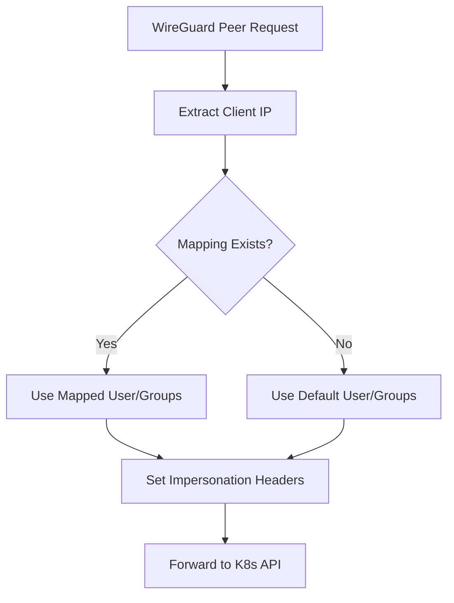

# User IP Mapping API Documentation

This document describes the admin API endpoints for managing user IP mappings in the Netmaker K8s Proxy.

## Overview

The proxy maintains an in-memory mapping of WireGuard peer IP addresses to Kubernetes users and groups. This mapping is used in **auth mode** to determine which user and groups to impersonate for incoming requests.

## API Endpoints

All admin endpoints are available at `/admin/` and do not require authentication (for simplicity in this implementation).

### 1. Get All User Mappings

**GET** `/admin/user-mappings`

Returns all current user IP mappings.

**Response:**
```json
{
  "status": "user_mappings",
  "data": {
    "10.0.0.1": {
      "user": "alice",
      "groups": ["system:authenticated", "developers"]
    },
    "10.0.0.2": {
      "user": "bob", 
      "groups": ["system:authenticated", "admins"]
    }
  }
}
```

**Example:**
```bash
curl http://localhost:8085/admin/user-mappings
```

### 2. Add User Mapping

**POST** `/admin/user-mappings`

Adds a new user IP mapping.

**Request Body:**
```json
{
  "ip": "10.0.0.1",
  "user": "alice",
  "groups": ["system:authenticated", "developers"]
}
```

**Response:**
```json
{
  "status": "mapping_added",
  "ip": "10.0.0.1",
  "user": "alice",
  "groups": ["system:authenticated", "developers"]
}
```

**Example:**
```bash
curl -X POST http://localhost:8085/admin/user-mappings \
  -H "Content-Type: application/json" \
  -d '{
    "ip": "10.0.0.1",
    "user": "alice",
    "groups": ["system:authenticated", "developers"]
  }'
```

### 3. Remove User Mapping

**DELETE** `/admin/user-mappings/{ip}`

Removes a user IP mapping.

**Response:**
```json
{
  "status": "mapping_removed",
  "ip": "10.0.0.1"
}
```

**Example:**
```bash
curl -X DELETE http://localhost:8085/admin/user-mappings/10.0.0.1
```

## How It Works

### Auth Mode Behavior

When the proxy is in **auth mode** and receives a request:

1. **Extract Client IP**: Gets the client IP from the request
2. **Lookup Mapping**: Checks if there's a mapping for that IP
3. **Apply Impersonation**:
   - If mapping exists: Uses the mapped user and groups
   - If no mapping: Falls back to default user/groups from environment variables
4. **Set Headers**: Adds `Impersonate-User` and `Impersonate-Group` headers

### Example Flow



## Usage Examples

### Basic Setup

1. **Start the proxy in auth mode:**
   ```bash
   export PROXY_MODE=auth
   export PROXY_IMPERSONATE_USER=default-user
   export PROXY_IMPERSONATE_GROUPS=system:authenticated,default-group
   ./netmaker-k8s-ops
   ```

2. **Add user mappings:**
   ```bash
   # Alice from 10.0.0.1 gets developer access
   curl -X POST http://localhost:8085/admin/user-mappings \
     -H "Content-Type: application/json" \
     -d '{"ip": "10.0.0.1", "user": "alice", "groups": ["system:authenticated", "developers"]}'
   
   # Bob from 10.0.0.2 gets admin access
   curl -X POST http://localhost:8085/admin/user-mappings \
     -H "Content-Type: application/json" \
     -d '{"ip": "10.0.0.2", "user": "bob", "groups": ["system:authenticated", "admins"]}'
   ```

3. **Verify mappings:**
   ```bash
   curl http://localhost:8085/admin/user-mappings
   ```

### Integration with External Systems

You can integrate the user mapping API with external systems:

#### Netmaker Integration

```bash
#!/bin/bash
# Script to sync Netmaker peer IPs with user mappings

# Get peer information from Netmaker API
PEERS=$(curl -s "https://your-netmaker-server/api/v1/networks/your-network/peers" \
  -H "Authorization: Bearer $NETMAKER_TOKEN")

# Process each peer
echo "$PEERS" | jq -r '.[] | @base64' | while read peer; do
  PEER_DATA=$(echo "$peer" | base64 -d)
  IP=$(echo "$PEER_DATA" | jq -r '.address')
  USER=$(echo "$PEER_DATA" | jq -r '.name')
  GROUPS=$(echo "$PEER_DATA" | jq -r '.groups // ["system:authenticated"]')
  
  # Add mapping to proxy
  curl -X POST http://localhost:8085/admin/user-mappings \
    -H "Content-Type: application/json" \
    -d "{\"ip\": \"$IP\", \"user\": \"$USER\", \"groups\": $GROUPS}"
done
```

#### LDAP Integration

```bash
#!/bin/bash
# Script to sync LDAP users with IP mappings

# Query LDAP for users and their IP addresses
ldapsearch -x -H ldap://your-ldap-server \
  -D "cn=admin,dc=example,dc=com" \
  -w "password" \
  -b "ou=users,dc=example,dc=com" \
  "(objectClass=person)" dn ipAddress | while read line; do
  if [[ $line == dn:* ]]; then
    USER=$(echo "$line" | sed 's/dn: cn=\([^,]*\).*/\1/')
  elif [[ $line == ipAddress:* ]]; then
    IP=$(echo "$line" | sed 's/ipAddress: //')
    GROUPS="system:authenticated,ldap-users"
    
    # Add mapping to proxy
    curl -X POST http://localhost:8085/admin/user-mappings \
      -H "Content-Type: application/json" \
      -d "{\"ip\": \"$IP\", \"user\": \"$USER\", \"groups\": [\"$GROUPS\"]}"
  fi
done
```

## RBAC Configuration

After setting up user mappings, configure Kubernetes RBAC for the mapped users:

### Example RBAC for Mapped Users

```yaml
# ClusterRole for developers
apiVersion: rbac.authorization.k8s.io/v1
kind: ClusterRole
metadata:
  name: developer
rules:
- apiGroups: [""]
  resources: ["pods", "services", "configmaps"]
  verbs: ["get", "list", "watch", "create", "update", "patch"]
- apiGroups: ["apps"]
  resources: ["deployments", "replicasets"]
  verbs: ["get", "list", "watch", "create", "update", "patch"]

---
# ClusterRoleBinding for developers
apiVersion: rbac.authorization.k8s.io/v1
kind: ClusterRoleBinding
metadata:
  name: developers
roleRef:
  apiGroup: rbac.authorization.k8s.io
  kind: ClusterRole
  name: developer
subjects:
- kind: Group
  name: developers
  apiGroup: rbac.authorization.k8s.io

---
# ClusterRole for admins
apiVersion: rbac.authorization.k8s.io/v1
kind: ClusterRole
metadata:
  name: admin
rules:
- apiGroups: ["*"]
  resources: ["*"]
  verbs: ["*"]

---
# ClusterRoleBinding for admins
apiVersion: rbac.authorization.k8s.io/v1
kind: ClusterRoleBinding
metadata:
  name: admins
roleRef:
  apiGroup: rbac.authorization.k8s.io
  kind: ClusterRole
  name: admin
subjects:
- kind: Group
  name: admins
  apiGroup: rbac.authorization.k8s.io
```

## Monitoring and Debugging

### Check Current Mappings

```bash
# Get all mappings
curl http://localhost:8085/admin/user-mappings | jq '.'

# Check specific IP
curl http://localhost:8085/admin/user-mappings | jq '.data["10.0.0.1"]'
```

### View Proxy Logs

```bash
# Check proxy logs for mapping lookups
kubectl logs -f deployment/netmaker-k8s-ops | grep "mapped_user\|default_user"

# Check for mapping changes
kubectl logs -f deployment/netmaker-k8s-ops | grep "mapping_added\|mapping_removed"
```

### Test Impersonation

```bash
# Test with a mapped IP
kubectl --kubeconfig=your-wireguard-kubeconfig get pods

# Check Kubernetes audit logs for impersonation headers
kubectl logs -f kube-apiserver-* | grep "Impersonate-User\|Impersonate-Group"
```

## Security Considerations

1. **Admin API Access**: The admin endpoints are currently unauthenticated. Consider adding authentication in production.

2. **IP Validation**: The API doesn't validate IP addresses. Ensure you're using valid IP addresses.

3. **Memory Storage**: Mappings are stored in memory and will be lost on restart. Consider implementing persistence if needed.

4. **RBAC Security**: Ensure the mapped users have appropriate RBAC permissions and follow the principle of least privilege.

## Troubleshooting

### Common Issues

1. **Mapping Not Applied**: Check if the proxy is in auth mode and the mapping was added correctly.

2. **Permission Denied**: Verify that the mapped user has appropriate RBAC permissions.

3. **Wrong User Impersonated**: Check the mapping and ensure the client IP matches exactly.

### Debug Commands

```bash
# Check proxy mode
kubectl exec deployment/netmaker-k8s-ops -- env | grep PROXY_MODE

# Check current mappings
curl http://localhost:8085/admin/user-mappings

# Test API connectivity
curl http://localhost:8085/health
```

## API Reference Summary

| Method | Endpoint | Description |
|--------|----------|-------------|
| GET | `/admin/user-mappings` | Get all user mappings |
| POST | `/admin/user-mappings` | Add a user mapping |
| DELETE | `/admin/user-mappings/{ip}` | Remove a user mapping |

## Next Steps

1. **Add Authentication**: Implement authentication for admin endpoints
2. **Add Persistence**: Store mappings in ConfigMap or CRD for persistence
3. **Add Validation**: Validate IP addresses and user/group names
4. **Add Monitoring**: Add metrics and alerts for mapping operations
5. **Add Bulk Operations**: Support bulk add/remove operations
